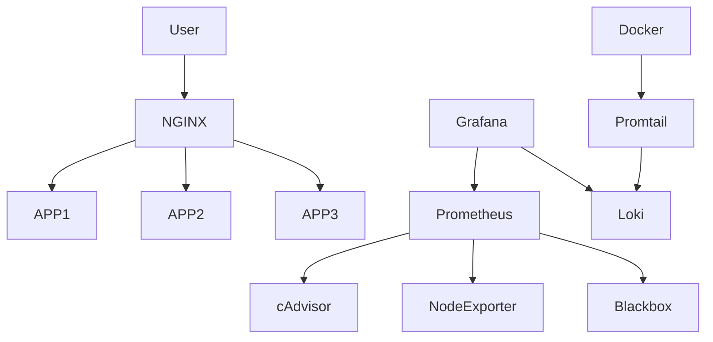

# Multi App Nginx Platform

Production-ready Docker platform with reverse proxy, monitoring, logging and scalable microservices architecture.

## Features

- Dockerized multi-service architecture
- NGINX reverse proxy
- SSL-ready infrastructure
- Grafana monitoring
- Prometheus metrics
- Loki centralized logging
- Promtail log shipping
- Container observability
- Health checks
- Production networking
- Security-focused setup
- Easy horizontal scaling

---

# Stack

## Backend
- Node.js
- Express

## Infrastructure
- Docker
- Docker Compose
- NGINX

## Monitoring
- Grafana
- Prometheus
- Loki
- Promtail
- cAdvisor
- Node Exporter

---

# Architecture

```text
Internet
    │
    ▼
NGINX Reverse Proxy
    │
    ├── App 1
    ├── App 2
    ├── APIs
    └── Static services

Monitoring Stack
    ├── Prometheus
    ├── Grafana
    ├── Loki
    ├── Promtail
    ├── cAdvisor
    └── Node Exporter

## Architecture Diagram



## Screenshots

### Grafana Monitoring Dashboard


### Loki Logs


### GitHub Actions CI/CD


### Running Docker Stack

