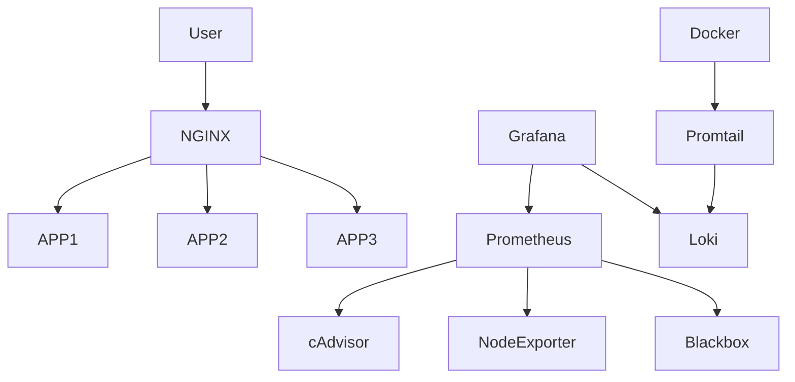
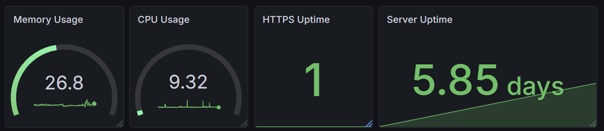
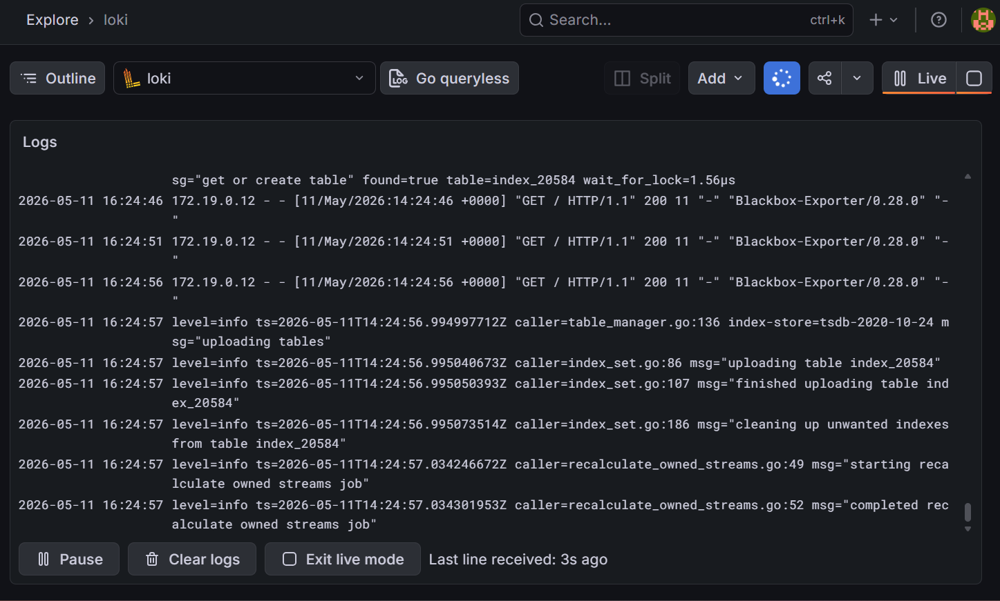
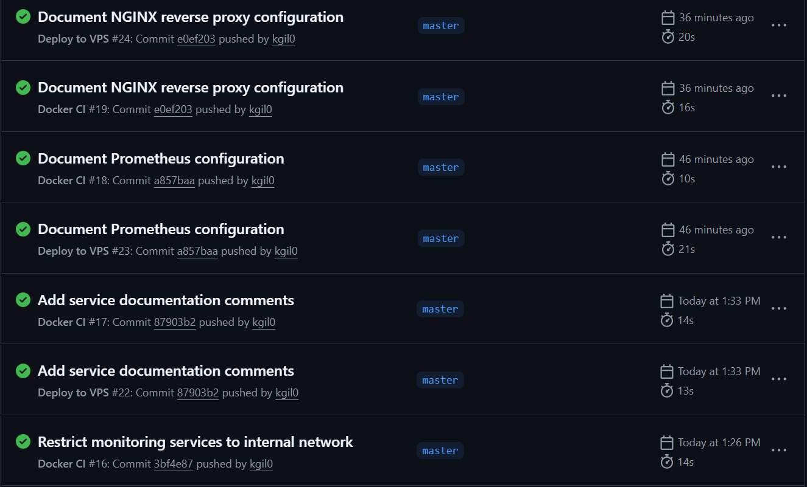
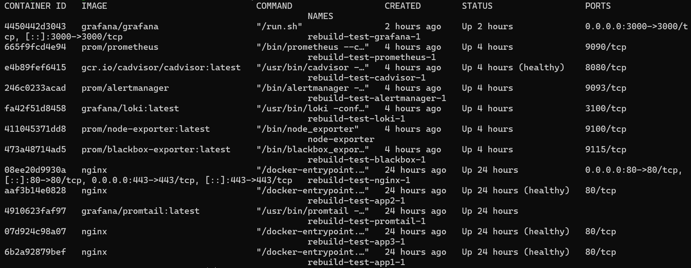
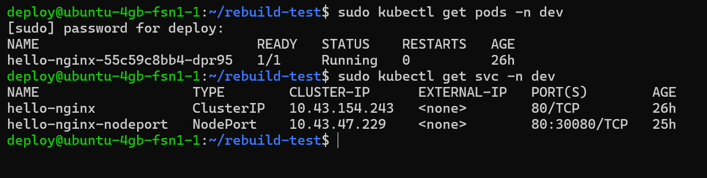

# Multi App Nginx Platform


Production-ready Docker platform with reverse proxy, monitoring, logging and scalable microservices architecture.

## Features

- Dockerized multi-service architecture
- NGINX reverse proxy
- SSL-ready infrastructure
- Grafana monitoring
- Prometheus metrics
- Loki centralized logging
- Promtail log shipping
- Container observability
- Health checks
- Production networking
- Security-focused setup
- Easy horizontal scaling
- GitHub Actions CI/CD
- Automated VPS deployment
- Post-deployment health checks
- Kubernetes / k3s integration
- Kubernetes namespaces
- ConfigMaps and Secrets
- NodePort services
- Reverse proxy integration with Kubernetes
- Bash automation scripts
- Cron-based health checks

---

## Stack

### Applications

- Static NGINX-based demo applications
- Multi-container application routing
- Reverse proxy backend failover

### Infrastructure

- Docker
- Docker Compose
- NGINX
- Kubernetes (k3s)
- Bash scripting
- Cron automation

### Monitoring

- Grafana
- Prometheus
- Blackbox Exporter
- Loki
- Promtail
- cAdvisor
- Node Exporter

---

## Architecture

```text
Internet
    │
    ▼
NGINX Reverse Proxy
    │
    ├── App 1
    ├── App 2
    ├── APIs
    └── Static services

Monitoring Stack
    ├── Prometheus
    ├── Grafana
    ├── Loki
    ├── Promtail
    ├── cAdvisor
    └── Node Exporter
```

## Architecture Diagram



## Networking Flow

```text
User
→ DNS
→ VPS Public IP
→ NGINX Reverse Proxy
→ Docker Internal Network
→ Backend Container
```

### Flow Explanation

- DNS resolves the domain to the VPS public IP address
- NGINX handles HTTPS termination and reverse proxying
- Requests are forwarded through the internal Docker network
- Backend containers are isolated from direct public access
- HTTP traffic is automatically redirected to HTTPS

## Screenshots

### Grafana Monitoring Dashboard


### Loki Logs


### GitHub Actions CI/CD


### Running Docker Stack


### Kubernetes Status


---

## Project Structure

```text
.
├── docker-compose.yml
├── nginx/
├── monitoring/
├── k8s/
├── scripts/
├── screenshots/
└── README.md
```

## CI/CD Workflow

GitHub Actions automatically:
- validates configuration
- deploys updated stack to VPS
- runs post-deployment health checks

## Automation

Infrastructure automation includes:
- healthcheck scripts
- cron-based monitoring validation
- Kubernetes service health verification

---

## What I Learned

- Docker container orchestration
- Reverse proxy configuration with NGINX
- HTTPS setup using Let's Encrypt
- Prometheus metrics collection
- Grafana dashboards and observability
- Loki centralized logging
- Docker networking and service isolation
- Firewall hardening with UFW
- Internal-only monitoring architecture
- Infrastructure troubleshooting and debugging
- CI/CD pipelines with GitHub Actions
- Automated deployment to VPS
- Healthcheck validation after deployment
- Kubernetes namespaces management
- ConfigMaps and Secrets handling
- NodePort networking
- Reverse proxy integration with Kubernetes
- Bash scripting for infrastructure automation
- Cron job automation
- Basic AWS EC2 experience
- AWS CLI basics
- Terraform Infrastructure as Code basics

## Kubernetes / k3s

This project also includes basic Kubernetes manifests for deploying an NGINX application on a k3s cluster.

### Implemented Features

- k3s installation on Ubuntu VPS
- Kubernetes Deployment
- Kubernetes ClusterIP Service
- Pod logs and debugging
- Replica scaling
- Rolling update
- Rollback
- Declarative YAML manifests
- Namespaces
- ConfigMaps
- Secrets
- NodePort Services
- Reverse proxy integration with Kubernetes
- Kubernetes healthcheck scripting

Manifests:
- `k8s/deployment.yaml`
- `k8s/service.yaml`

## Related Projects

- Terraform AWS EC2:
  https://github.com/kgil0/terraform-aws-ec2

### Docker Port Exposure

Only the NGINX reverse proxy exposes public host ports:

- 80/tcp
- 443/tcp

Monitoring services such as Grafana, Prometheus and Loki are available only inside the Docker internal network and are not directly exposed to the public internet.

### Grafana Persistence

Grafana uses a named Docker volume:

```text
rebuild-test_grafana-data → /var/lib/grafana
```

This keeps Grafana data such as `grafana.db`, dashboards and configuration persistent even if the Grafana container is removed and recreated.

### Docker Internal DNS

Containers inside the same Docker Compose network can communicate using service names instead of IP addresses.

Examples tested from the NGINX container:

```bash
curl http://grafana:3000
curl -I http://prometheus:9090
curl -I http://app1:80
```
